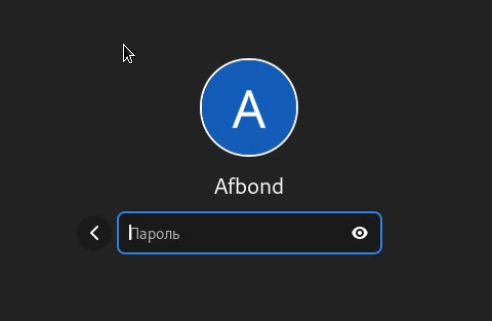
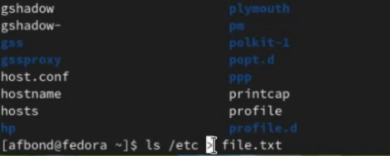

---
## Front matter
title: "Лабораторная работа №7 по предмету Операционные системы"
subtitle: "Группа НПМбв-01-19"
author: "Бондаренко Артем Федорович"

## Generic otions
lang: ru-RU
toc-title: "Содержание"

## Bibliography
bibliography: bib/cite.bib
csl: pandoc/csl/gost-r-7-0-5-2008-numeric.csl

## Pdf output format
toc: true # Table of contents
toc-depth: 2
lof: true # List of figures
lot: true # List of tables
fontsize: 12pt
linestretch: 1.5
papersize: a4
documentclass: scrreprt
## I18n polyglossia
polyglossia-lang:
  name: russian
polyglossia-otherlangs:
  name: english
## I18n babel
babel-lang: russian
babel-otherlangs: english
## Fonts
mainfont: PT Serif
romanfont: PT Serif
sansfont: PT Sans
monofont: PT Mono
mainfontoptions: Ligatures=TeX
romanfontoptions: Ligatures=TeX
sansfontoptions: Ligatures=TeX,Scale=MatchLowercase
monofontoptions: Scale=MatchLowercase,Scale=0.9
## Biblatex
biblatex: true
biblio-style: "gost-numeric"
biblatexoptions:
  - parentracker=true
  - backend=biber
  - hyperref=auto
  - language=auto
  - autolang=other*
  - citestyle=gost-numeric
## Pandoc-crossref LaTeX customization
figureTitle: "Рис."
tableTitle: "Таблица"
listingTitle: "Листинг"
lofTitle: "Список иллюстраций"
lotTitle: "Список таблиц"
lolTitle: "Листинги"
## Misc options
indent: true
header-includes:
  - \usepackage{indentfirst}
  - \usepackage{float} # keep figures where there are in the text
  - \floatplacement{figure}{H} # keep figures where there are in the text
---
# Цель работы

Ознакомление с инструментами поиска файлов и фильтрации текстовых данных. Приобретение практических навыков: по управлению процессами (и заданиями), по проверке использования диска и обслуживанию файловых систем.


# Задание

1. Осуществите вход в систему, используя соответствующее имя пользователя.
2. Запишите в файл file.txt названия файлов, содержащихся в каталоге /etc.
Допишите в этот же файл названия файлов, содержащихся в вашем домашнем
каталоге.
3. Выведите имена всех файлов из file.txt, имеющих расширение .conf, после
чего запишите их в новый текстовой файл conf.txt.
4. Определите, какие файлы в вашем домашнем каталоге имеют имена, начинавшиеся с символа c? Предложите несколько вариантов, как это сделать.
5. Выведите на экран (по странично) имена файлов из каталога /etc, начинающиеся с символа h.
6. Запустите в фоновом режиме процесс, который будет записывать в файл
~/logfile файлы, имена которых начинаются с log.
7. Удалите файл ~/logfile.
8. Запустите из консоли в фоновом режиме редактор gedit.
9. Определите идентификатор процесса gedit, используя команду ps, конвейер и
фильтр grep. Можно ли определить этот идентификатор более простым способом?
10. Прочтите справку (man) команды kill, после чего используйте её для завершения процесса gedit.
11. Выполните команды df и du, предварительно получив более подробную информацию об этих командах, с помощью команды man.
12. Воспользовавшись справкой команды find, выведите имена всех директорий,
имеющихся в вашем домашнем каталоге.


# Выполнение лабораторной работы

Осуществляю вход в систему, используя соответствующее имя пользователя. (Ссылка: Рис.1)



```
```
Запишу в файл file.txt названия файлов, содержащихся в каталоге /etc. (Ссылка: Рис.2)



Допишу в этот же файл названия файлов, содержащихся в вашем домашнем каталоге. (Ссылка: Рис.3)


```
```
Выведу имена всех файлов из file.txt, имеющих расширение .conf. С помощью команды cat чтобы вывести результат, и применяя команду grep чтобы результат соответствовал искомому. (Ссылка: Рис.4)


Запишу их в новый текстовой файл conf.txt. (Ссылка: Рис.5)


```
```
Определю, какие файлы в моей домашнем каталоге имеют имена, начинавшиеся с символа c.


Вот еще несколько вариантов, как это сделать.


```
```
Выведу на экран (по странично с пощью команды ) имена файлов из каталога /etc, начинающиеся с символа h.


# Выводы

Таким образом, мы ознакомлись с инструментами поиска файлов и фильтрации текстовых данных. Приобрели практические навыки: по управлению процессами (и заданиями), по проверке использования диска и обслуживанию файловых систем.

# Ответы на контрольные вопросы

1. Какие потоки ввода вывода вы знаете?

Существуют три основных потока ввода/вывода:

stdin (стандартный ввод) - поток ввода данных, по умолчанию связанный с клавиатурой;
stdout (стандартный вывод) - поток вывода данных, по умолчанию связанный с экраном;
stderr (стандартный вывод ошибок) - поток вывода ошибок, по умолчанию связанный с экраном.

2. Объясните разницу между операцией > и >>.
 
Операция > перенаправляет вывод команды в файл и перезаписывает содержимое файла, если он уже существует.
Операция >> также перенаправляет вывод команды в файл, но добавляет его в конец файла, не удаляя при этом предыдущее содержимое файла. 
Таким образом, операция > перезаписывает содержимое файла, а операция >> добавляет в конец файла.

3. Что такое конвейер?
 
Конвейер (pipeline) - это механизм в Unix-подобных операционных системах, позволяющий связывать несколько команд, передавая вывод одной команды в качестве входных данных следующей команде. Таким образом, конвейер позволяет строить сложные командные цепочки, выполняя несколько команд одновременно, что может существенно упростить обработку данных.

4. Что такое процесс? Чем это понятие отличается от программы?
 
Процесс - это исполняющийся экземпляр программы. Он создается операционной системой при запуске программы и содержит информацию о состоянии программы во время выполнения, включая значения переменных, указатели на стек, открытые файлы и другую информацию. Процесс обладает своим уникальным идентификатором (PID), который используется для управления им из командной строки или других программ.

Программа, с другой стороны, является набором инструкций и данных, сохраненных в виде файла на диске. Программа не может выполняться сама по себе и требует создания процесса для ее запуска.

Таким образом, разница между программой и процессом заключается в том, что программа - это статический набор инструкций и данных, в то время как процесс - это динамический экземпляр программы, который выполняется в операционной системе и имеет свои собственные ресурсы.


5. Что такое PID и GID?
 
PID (Process IDentifier) и GID (Group IDentifier) - это два разных идентификатора в Unix-подобных операционных системах.

PID - это числовой идентификатор, присваиваемый операционной системой каждому процессу, который запущен на компьютере. Каждый раз, когда запускается новый процесс, операционная система назначает ему уникальный PID, который используется для идентификации этого процесса в системе. PID может использоваться для управления процессами, например, для приостановки, возобновления или прекращения работы процесса.

GID - это идентификатор группы, который назначается каждой группе в Unix-подобных системах. Группа - это набор пользователей, который имеет общие права и ограничения. Каждый пользователь может принадлежать к одной или нескольким группам, и каждая группа имеет свой GID. GID используется для управления правами доступа к файлам и каталогам, которые могут быть доступны только для членов определенной группы.

6. Что такое задачи и какая команда позволяет ими управлять?

Задача - это процесс, который выполняется в фоновом или переднем режиме. В переднем режиме задача запускается из командной строки и управляется этой командной строкой, то есть она ожидает завершения задачи, прежде чем возвращаться к командной строке. В фоновом режиме задача запускается с помощью символа "&" в конце команды, и управление возвращается к командной строке, позволяя пользователю продолжать работу.

Для управления задачами в Unix-подобных системах используются команды работы с задачами. Некоторые из наиболее часто используемых команд:

jobs - список задач, запущенных в фоновом режиме
fg - переключение задачи в передний план
bg - переключение задачи в фоновый режим
kill - остановка задачи
ps - вывод списка процессов, в том числе запущенных задач

7. Найдите информацию об утилитах top и htop. Каковы их функции?

Утилиты top и htop являются системными мониторами, предназначенными для отслеживания процессов и системных ресурсов на Unix-подобных операционных системах.

Команда top показывает текущее состояние системы, список запущенных процессов, их PID (идентификатор процесса), использование процессора и памяти, а также другую информацию о системе. Она также позволяет управлять процессами, изменять приоритеты процессов и прерывать их выполнение.

Утилита htop является более продвинутой версией top, предоставляющей больше информации и более удобный интерфейс. Она позволяет быстро просматривать процессы и ресурсы системы, управлять процессами, настраивать отображение информации и многое другое.

Обе утилиты являются очень полезными инструментами для мониторинга системы и отладки проблем в процессах. Они могут помочь в установлении, какие процессы занимают больше всего системных ресурсов, и какие процессы работают слишком долго.

8. Назовите и дайте характеристику команде поиска файлов. Приведите примеры использования этой команды.

Одной из наиболее часто используемых команд для поиска файлов является команда find. Ее основная функция заключается в поиске файлов и каталогов на основе заданных критериев.

Синтаксис команды:
```
find [путь к каталогу] [опция]
```

Примеры использования команды:

Найти все файлы в текущем каталоге, включая подкаталоги:
```
find . -type f
```
Найти все файлы с расширением .txt в домашнем каталоге пользователя:
```
find ~ -name "*.txt"
```
Найти все файлы, измененные в течение последних 24 часов:

find . -mtime 0

Найти все пустые каталоги в текущем каталоге:
```
find . -type d -empty
```
9. Можно ли по контексту (содержанию) найти файл? Если да, то как?

Да, можно найти файл по его содержимому. Для этого используется команда grep, которая позволяет искать текст внутри файлов. Синтаксис команды grep выглядит следующим образом:
```
grep [опция] [шаблон] [файл]
```
Опции могут включать, например, -r для рекурсивного поиска в подкаталогах(В контексте поиска файлов, рекурсивный поиск означает поиск файлов не только в указанной директории, но и во всех ее поддиректориях, в том числе и в поддиректориях этих поддиректорий и т.д. до конца иерархии каталогов), -i для игнорирования регистра символов, -n для вывода номеров строк, содержащих совпадения, и т.д.

Шаблон - это строка, которую мы ищем в файле. Если файл содержит данную строку, то команда grep выведет эту строку на экран.

Примеры использования команды grep:

Поиск строки "hello" в файле file.txt:
```
grep "hello" file.txt
```


10. Как определить объем свободной памяти на жёстком диске?

Чтобы определить объем свободной памяти на жестком диске в Linux, можно использовать команду df с флагом -h (отображение в человекочитаемом формате):
```
df -h
```
Эта команда выведет информацию о свободном месте на всех файловых системах, подключенных к вашей системе. 


11. Как определить объем вашего домашнего каталога?

Чтобы определить объем вашего домашнего каталога, можно воспользоваться командой du. Вот пример ее использования:
```
du -sh ~/
```
du - команда для подсчета объема файлов и каталогов;
-s - опция для вывода только общего объема, без детализации по подкаталогам;
-h - опция для вывода размера в удобочитаемом формате (например, "2.3G").
Знак ~ используется для обозначения домашнего каталога текущего пользоваля
Результатом выполнения команды будет вывод размера домашнего каталога в удобочитаемом формате.


12. Как удалить зависший процесс?

Для удаления зависшего процесса можно воспользоваться командой kill с указанием идентификатора процесса (PID).

Сначала нужно определить PID зависшего процесса. Для этого можно воспользоваться командой ps aux | grep <имя_процесса> для вывода списка всех процессов и их идентификаторов. Например, для поиска PID процесса Firefox нужно выполнить команду ps aux | grep firefox.

Если процесс завис, то возможно, что он не реагирует на сигналы. В этом случае можно попытаться принудительно завершить процесс с помощью команды kill -9 <PID>. Например, для завершения процесса Firefox с PID 1234 нужно выполнить команду kill -9 1234.

Если процесс после этого не завершается, то можно попробовать использовать команду killall для завершения всех процессов с заданным именем. Например, для завершения всех процессов Firefox нужно выполнить команду killall firefox.


