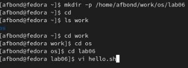

---
## Front matter
title: "Лабораторная работа №9 по предмету Операционные системы"
subtitle: "Группа НПМбв-01-19"
author: "Бондаренко Артем Федорович"

## Generic otions
lang: ru-RU
toc-title: "Содержание"

## Bibliography
bibliography: bib/cite.bib
csl: pandoc/csl/gost-r-7-0-5-2008-numeric.csl

## Pdf output format
toc: true # Table of contents
toc-depth: 2
lof: true # List of figures
lot: true # List of tables
fontsize: 12pt
linestretch: 1.5
papersize: a4
documentclass: scrreprt
## I18n polyglossia
polyglossia-lang:
  name: russian
polyglossia-otherlangs:
  name: english
## I18n babel
babel-lang: russian
babel-otherlangs: english
## Fonts
mainfont: PT Serif
romanfont: PT Serif
sansfont: PT Sans
monofont: PT Mono
mainfontoptions: Ligatures=TeX
romanfontoptions: Ligatures=TeX
sansfontoptions: Ligatures=TeX,Scale=MatchLowercase
monofontoptions: Scale=MatchLowercase,Scale=0.9
## Biblatex
biblatex: true
biblio-style: "gost-numeric"
biblatexoptions:
  - parentracker=true
  - backend=biber
  - hyperref=auto
  - language=auto
  - autolang=other*
  - citestyle=gost-numeric
## Pandoc-crossref LaTeX customization
figureTitle: "Рис."
tableTitle: "Таблица"
listingTitle: "Листинг"
lofTitle: "Список иллюстраций"
lotTitle: "Список таблиц"
lolTitle: "Листинги"
## Misc options
indent: true
header-includes:
  - \usepackage{indentfirst}
  - \usepackage{float} # keep figures where there are in the text
  - \floatplacement{figure}{H} # keep figures where there are in the text
---
# Цель работы

Познакомиться с операционной системой Linux. Получить практические навыки работы с редактором vi, установленным по умолчанию практически во всех дистрибутивах.


# Задание

**Задание 1. Создание нового файла с использованием vi**

1. Создайте каталог с именем ~/work/os/lab06.

2. Перейдите во вновь созданный каталог.

3. Вызовите vi и создайте файл hello.sh 

vi hello.sh

4. Нажмите клавишу i и вводите следующий текст.
```
#!/bin/bash

HELL=Hello

function hello {

LOCAL HELLO=World

echo $HELLO

}

echo $HELLO

hello
```
5. Нажмите клавишу Esc для перехода в командный режим после завершения ввода текста.

6. Нажмите : для перехода в режим последней строки и внизу вашего экрана появится приглашение в виде двоеточия.

7. Нажмите w (записать) и q (выйти), а затем нажмите клавишу Enter для сохранения вашего текста и завершения работы.

8. Сделайте файл исполняемым

chmod +x hello.sh

**Задание 2. Редактирование существующего файла**

1. Вызовите vi на редактирование файла

vi ~/work/os/lab06/hello.sh

2. Установите курсор в конец слова HELL второй строки.

3. Перейдите в режим вставки и замените на HELLO. Нажмите Esc для возврата в командный режим.

4. Установите курсор на четвертую строку и сотрите слово LOCAL.

5. Перейдите в режим вставки и наберите следующий текст: local, нажмите Esc для возврата в командный режим.

6. Установите курсор на последней строке файла. Вставьте после неё строку, содержащую следующий текст: echo $HELLO.

7. Нажмите Esc для перехода в командный режим.

8. Удалите последнюю строку.

9. Введите команду отмены изменений u для отмены последней команды.

10. Введите символ : для перехода в режим последней строки. Запишите произведённые изменения и выйдите из vi.


# Выполнение лабораторной работы

Описываются проведённые действия, в качестве иллюстрации даётся ссылка на иллюстрацию (рис. @fig:001).



```
```

# Выводы

Таким образом, мы познакомились с операционной системой Linux. Получили практические навыки работы с редактором vi, освоили основные функции этого редактора, получили знания о том, как правильно и наилучшим образом взаимодействовать с ним, поличил знания об основных командах.

# Ответы на контрольные вопросы

1. Дайте краткую характеристику режимам работы редактора vi.

2. Как выйти из редактора, не сохраняя произведённые изменения?

3. Назовите и дайте краткую характеристику командам позиционирования.

4. Что для редактора vi является словом?

5. Каким образом из любого места редактируемого файла перейти в начало (конец) файла?

6. Назовите и дайте краткую характеристику основным группам команд редактирования.

7. Необходимо заполнить строку символами $. Каковы ваши действия?

8. Как отменить некорректное действие, связанное с процессом редактирования?

9. Назовите и дайте характеристику основным группам команд режима последней строки.

10. Как определить, не перемещая курсора, позицию, в которой заканчивается строка?

11. Выполните анализ опций редактора vi (сколько их, как узнать их назначение и т.д.).

12. Как определить режим работы редактора vi?

13. Постройте граф взаимосвязи режимов работы редактора vi.

