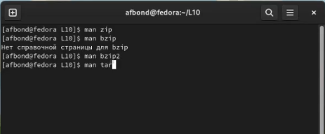
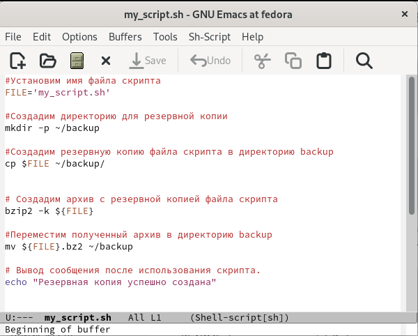
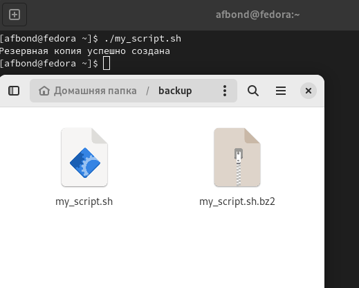
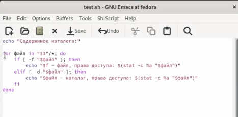
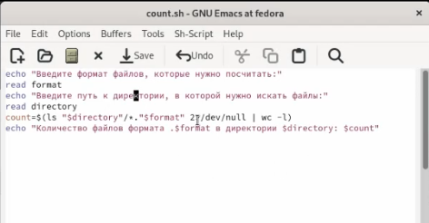

---
## Front matter
title: "Лабораторная работа №11 по предмету Операционные системы"
subtitle: "Группа НПМбв-01-19"
author: "Бондаренко Артем Федорович"

## Generic otions
lang: ru-RU
toc-title: "Содержание"

## Bibliography
bibliography: bib/cite.bib
csl: pandoc/csl/gost-r-7-0-5-2008-numeric.csl

## Pdf output format
toc: true # Table of contents
toc-depth: 2
lof: true # List of figures
lot: true # List of tables
fontsize: 12pt
linestretch: 1.5
papersize: a4
documentclass: scrreprt
## I18n polyglossia
polyglossia-lang:
  name: russian
polyglossia-otherlangs:
  name: english
## I18n babel
babel-lang: russian
babel-otherlangs: english
## Fonts
mainfont: PT Serif
romanfont: PT Serif
sansfont: PT Sans
monofont: PT Mono
mainfontoptions: Ligatures=TeX
romanfontoptions: Ligatures=TeX
sansfontoptions: Ligatures=TeX,Scale=MatchLowercase
monofontoptions: Scale=MatchLowercase,Scale=0.9
## Biblatex
biblatex: true
biblio-style: "gost-numeric"
biblatexoptions:
  - parentracker=true
  - backend=biber
  - hyperref=auto
  - language=auto
  - autolang=other*
  - citestyle=gost-numeric
## Pandoc-crossref LaTeX customization
figureTitle: "Рис."
tableTitle: "Таблица"
listingTitle: "Листинг"
lofTitle: "Список иллюстраций"
lotTitle: "Список таблиц"
lolTitle: "Листинги"
## Misc options
indent: true
header-includes:
  - \usepackage{indentfirst}
  - \usepackage{float} # keep figures where there are in the text
  - \floatplacement{figure}{H} # keep figures where there are in the text
---
# Цель работы

Изучить основы программирования в оболочке ОС UNIX/Linux. Научиться писать небольшие командные файлы.


# Задание

1. Написать скрипт, который при запуске будет делать резервную копию самого себя (то есть файла, в котором содержится его исходный код) в другую директорию backup в вашем домашнем каталоге. При этом файл должен архивироваться одним из архиваторов на выбор zip, bzip2 или tar. Способ использования команд архивации необходимо узнать, изучив справку.

2. Написать пример командного файла, обрабатывающего любое произвольное число аргументов командной строки, в том числе превышающее десять. Например, скрипт может последовательно распечатывать значения всех переданных аргументов.

3. Написать командный файл — аналог команды ls (без использования самой этой команды и команды dir). Требуется, чтобы он выдавал информацию о нужном каталоге и выводил информацию о возможностях доступа к файлам этого каталога.

4. Написать командный файл, который получает в качестве аргумента командной строки формат файла (.txt, .doc, .jpg, .pdf и т.д.) и вычисляет количество таких файлов в указанной директории. Путь к директории также передаётся в виде аргумента командной строки.


# Выполнение лабораторной работы

Написал скрипт, который при запуске будет делать резервную копию самого себя (то есть файла, в котором содержится его исходный код) в другую директорию backup в моём домашнем каталоге. (Ссылка: Рис.2) При этом файл архивируется архиватором bzip2. Способ использования команд архивации узнал, изучив справку по ним. (Ссылка: Рис.1).
В результате исполнения скрипта получил резервную копию самого скрипта и архивированную копию в папке backup в моем домашнем каталоге.







2. Написал пример командного файла, обрабатывающего любое произвольное число аргументов командной строки, в том числе превышающее десять.(Ссылка: Рис.4) Например, скрипт может последовательно распечатывать значения всех переданных аргументов.(Ссылка: Рис.5)


3. Написал командный файл — аналог команды ls (без использования самой этой команды и команды dir).(Ссылка: Рис.6) Он выдает информацию о каталогах в указанной директории и выводит информацию о возможностях доступа к файлам и каталогам в этой директории. (Ссылка: Рис.7)




4. Написал командный файл, который получает в качестве аргумента командной строки формат файла (.txt, .doc, .jpg, .pdf и т.д.) и вычисляет количество таких файлов в указанной директории.(Ссылка: Рис.8) Путь к директории также передаётся в виде аргумента командной строки.(Ссылка: Рис.9)




```
```

# Выводы

Таким образом, мы зучили основы программирования в оболочке ОС UNIX/Linux. Научились писать небольшие командные файлы, например, которые обрабатывают произвольное число аргументов, командные файлы которые используются как аналог други командам, а также научились писать скрипты.

# Ответы на контрольные вопросы

1. Объясните понятие командной оболочки. Приведите примеры командных оболочек. Чем они отличаются?

Командный процессор (командная оболочка, интерпретатор команд shell) — это программа, позволяющая пользователю взаимодействовать с операционной системой компьютера. В операционных системах типа UNIX/Linux наиболее часто используются следующие реализации командных оболочек:

– оболочка Борна (Bourne shell или sh) — стандартная командная оболочка UNIX/Linux, содержащая базовый, но при этом полный набор функций;

– С-оболочка (или csh) — надстройка на оболочкой Борна, использующая Сподобный синтаксис команд с возможностью сохранения истории выполнения команд;

– оболочка Корна (или ksh) — напоминает оболочку С, но операторы управления программой совместимы с операторами оболочки Борна;

– BASH — сокращение от Bourne Again Shell (опять оболочка Борна), в основе своей совмещает свойства оболочек С и Корна (разработка компании Free Software Foundation).

POSIX (Portable Operating System Interface for Computer Environments) — набор стандартов описания интерфейсов взаимодействия операционной системы и прикладных программ.

2. Что такое POSIX?

POSIX (Portable Operating System Interface for Computer Environments) — набор стандартов описания интерфейсов взаимодействия операционной системы и прикладных программ.

Стандарты POSIX разработаны комитетом IEEE (Institute of Electrical and Electronics Engineers) для обеспечения совместимости различных UNIX/Linuxподобных операционных систем и переносимости прикладных программ на уровне исходного кода. POSIX-совместимые оболочки разработаны на базе оболочки Корна.

3. Как определяются переменные и массивы в языке программирования bash?

Командный процессор bash обеспечивает возможность использования переменных типа строка символов. Использование значения, присвоенного некоторой переменной, называется подстановкой. Для того чтобы имя переменной не сливалось с символами, которые могут следовать за ним в командной строке, при подстановке в общем случае используется следующая форма записи:

```
${имя переменной}
```

Например, использование команд
b=/tmp/andyls -l myfile > ${b}lssudo apt-get install texlive-luatex
приведёт к переназначению стандартного вывода команды ls с терминала на файл
/tmp/andy-ls, а использование команды ls -l>$bls приведёт к подстановке в
командную строку значения переменной bls. Если переменной bls не было предварительно присвоено никакого значения, то её значением будет символ пробела.

Оболочка bash позволяет работать с массивами. Для создания массива используется команда set с флагом -A. За флагом следует имя переменной, а затем списокзначений, разделённых пробелами. Например, 

```
set -A states Delaware  Michigan "New Jersey"

```
Далее можно сделать добавление в массив, например, states[49]=Alaska. Индексация массивов начинается с нулевого элемента.

4. Каково назначение операторов let и read?


5. Какие арифметические операции можно применять в языке программирования bash?


6. Что означает операция (( ))?


7. Какие стандартные имена переменных Вам известны?


8. Что такое метасимволы?


9. Как экранировать метасимволы?


10. Как создавать и запускать командные файлы?


11. Как определяются функции в языке программирования bash?


12. Каким образом можно выяснить, является файл каталогом или обычным файлом?


13. Каково назначение команд set, typeset и unset?


14. Как передаются параметры в командные файлы?


15. Назовите специальные переменные языка bash и их назначение

