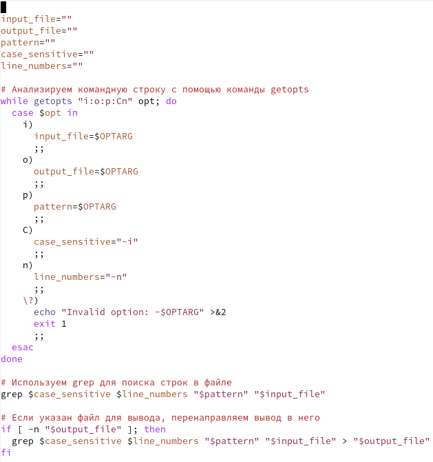
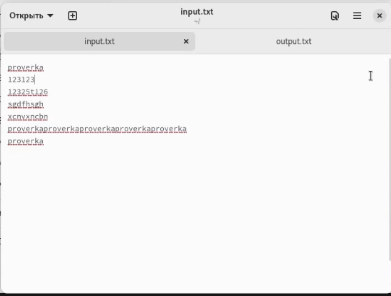
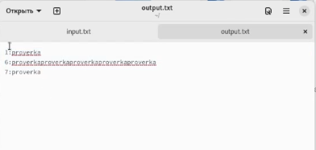
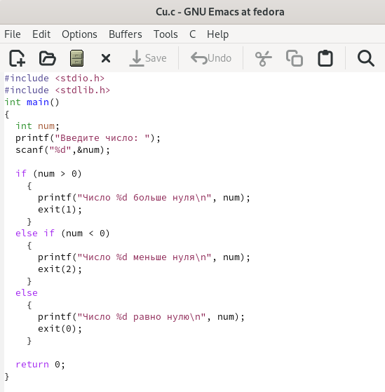
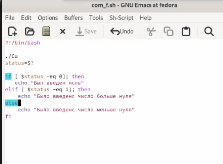
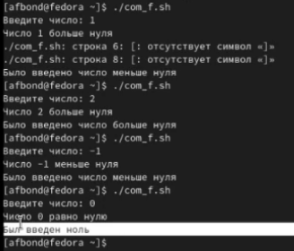
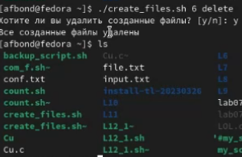

---
## Front matter
title: "Лабораторная работа №12 по предмету Операционные системы"
subtitle: "Группа НПМбв-01-19"
author: "Бондаренко Артем Федорович"

## Generic otions
lang: ru-RU
toc-title: "Содержание"

## Bibliography
bibliography: bib/cite.bib
csl: pandoc/csl/gost-r-7-0-5-2008-numeric.csl

## Pdf output format
toc: true # Table of contents
toc-depth: 2
lof: true # List of figures
lot: true # List of tables
fontsize: 12pt
linestretch: 1.5
papersize: a4
documentclass: scrreprt
## I18n polyglossia
polyglossia-lang:
  name: russian
polyglossia-otherlangs:
  name: english
## I18n babel
babel-lang: russian
babel-otherlangs: english
## Fonts
mainfont: PT Serif
romanfont: PT Serif
sansfont: PT Sans
monofont: PT Mono
mainfontoptions: Ligatures=TeX
romanfontoptions: Ligatures=TeX
sansfontoptions: Ligatures=TeX,Scale=MatchLowercase
monofontoptions: Scale=MatchLowercase,Scale=0.9
## Biblatex
biblatex: true
biblio-style: "gost-numeric"
biblatexoptions:
  - parentracker=true
  - backend=biber
  - hyperref=auto
  - language=auto
  - autolang=other*
  - citestyle=gost-numeric
## Pandoc-crossref LaTeX customization
figureTitle: "Рис."
tableTitle: "Таблица"
listingTitle: "Листинг"
lofTitle: "Список иллюстраций"
lotTitle: "Список таблиц"
lolTitle: "Листинги"
## Misc options
indent: true
header-includes:
  - \usepackage{indentfirst}
  - \usepackage{float} # keep figures where there are in the text
  - \floatplacement{figure}{H} # keep figures where there are in the text
---
# Цель работы

Изучить основы программирования в оболочке ОС UNIX. Научится писать более сложные командные файлы с использованием логических управляющих конструкций и циклов.


# Задание

1. Используя команды getopts grep, написать командный файл, который анализирует командную строку с ключами:
```
    – -iinputfile — прочитать данные из указанного файла;

    – -ooutputfile — вывести данные в указанный файл;

    – -pшаблон — указать шаблон для поиска;

    – -C — различать большие и малые буквы;

    – -n — выдавать номера строк.
```
а затем ищет в указанном файле нужные строки, определяемые ключом -p.

2. Написать на языке Си программу, которая вводит число и определяет, является ли оно больше нуля, меньше нуля или равно нулю. Затем программа завершается с помощью функции exit(n), передавая информацию в о коде завершения в оболочку. Командный файл должен вызывать эту программу и, проанализировав с помощью команды $?, выдать сообщение о том, какое число было введено.

3. Написать командный файл, создающий указанное число файлов, пронумерованных последовательно от 1 до N (например 1.tmp, 2.tmp, 3.tmp,4.tmp и т.д.). Число файлов, которые необходимо создать, передаётся в аргументы командной строки. Этот же командный файл должен уметь удалять все созданные им файлы (если они существуют).

4. Написать командный файл, который с помощью команды tar запаковывает в архив все файлы в указанной директории. Модифицировать его так, чтобы запаковывались только те файлы, которые были изменены менее недели тому назад (использовать команду find).


# Выполнение лабораторной работы

 Используя команды getopts grep, написал командный файл, который анализирует командную строку с ключами:
```
    – -input_file — прочитать данные из указанного файла;

    – -output_file — вывести данные в указанный файл;

    – -pattern — указать шаблон для поиска;

    – case_sensitive— различать большие и малые буквы;

    – line-number — выдавать номера строк.
```
а затем ищет в указанном файле нужные строки, определяемые ключом -p.(Ссылка: Рис.1) (Ссылка: Рис.3)




Рис. 1: Код программы

Результат работы командного файла (Ссылка: Рис.2) 

Рис. 2: Файл input

Тестовый файл из которого командный файл будет искать символы (Ссылка: Рис.2) 




Рис. 3: Запуск созданного командного файла с соответствующими аргументами и опциями

После исполнения командного файла искомые результаты сохраняются в отдельном файле output (Ссылка: Рис.4)




Рис. 4: Созданный в результате исполнения программы файл output с искомыми строками


Написал на языке Си программу, в которую нужно ввести число, после чего она определяет, является ли введенное число больше нуля, меньше нуля или равно нулю. (Ссылка: Рис.5) 




Рис. 5: Код программы написанный на Си


Затем с помощью команды gcc скомпилировал её в исполняемый файл и далее написал командный файл на bash (Ссылка: Рис.6), который вызывает программу на Си и, проанализировав её с помощью команды $?, выдает сообщение о том, какое число было введено. (Ссылка: Рис.7)



Рис. 6: Код программы написанный на bash



Рис. 7: Результат выполнения командного файла в терминале


Написал командный файл, создающий указанное число файлов, пронумерованных последовательно от 1 до i (например 1.tmp, 2.tmp, 3.tmp,4.tmp и т.д.). (Ссылка: Рис.8)


Рис. 8: Код программы

Число файлов, которые необходимо создать, передаётся в аргументы командной строки. Этот командный файл умеет удалять созданные файлы, был написан код который позволяет задать второй аргумент "delete", после чего пользователю будет предложен выбор, удалять созданные файлы или нет. (Ссылка: Рис.9) (Ссылка: Рис.10)


Рис. 9: Результат выполнения командного файла в терминале без аргумента deletе, демонстация созданных файлов



Рис. 10: Результат выполнения командного файла в терминале со вторым аргумен-том deletе, демонстация созданных файлов

 Написал командный файл, который с помощью команды tar запаковывает в архив все файлы в указанной директории. Модифицировал его так, чтобы запаковывались только те файлы, которые были изменены менее недели тому назад. (Ссылка: Рис.11) (Ссылка: Рис.12)
 


Рис. 11: Код программы

 


Рис. 12: Результат выполнения командного файла в терминале

# Выводы

Таким образом, мы изучили основы программирования в оболочке ОС UNIX. Научились писать более сложные командные файлы с использованием логических управляющих конструкций и циклов. Например, командные файлы которые анализируют командную строку с ключами на языке Си и которые выводят необходимый запрос, научились создавать командные файлы которые в автоматическом режиме запаковывают в архив все необходимые файлы.

# Ответы на контрольные вопросы

1. Каково предназначение команды getopts?

Команда getopts в скриптах оболочки Unix/Linux предназначена для обработки опций командной строки. Она позволяет скрипту получать аргументы командной строки в определенном формате, что делает его более удобным для использования конечными пользователями.

Команда getopts используется в цикле while, который обрабатывает каждый аргумент командной строки по очереди. При этом можно задать различные флаги и параметры для каждой опции, чтобы указать, как они должны быть обработаны. Например, вы можете указать, что опция должна иметь параметр, или что она является флагом, который просто включается или выключается.

Кроме того, getopts позволяет обрабатывать несколько опций в одном аргументе командной строки, а также определить опцию по умолчанию, которая будет использоваться, если пользователь не указал никаких опций.

2. Какое отношение метасимволы имеют к генерации имён файлов?

Метасимволы в Unix-подобных операционных системах используются для генерации имён файлов с помощью шаблонов. Эти метасимволы, такие как звездочка (*), вопросительный знак (?) и квадратные скобки ([]), могут использоваться для указания шаблона имени файла, который должен соответствовать определенному шаблону.

Например, вы можете использовать метасимвол звездочки для указания шаблона имени файла, который должен начинаться с "log" и заканчиваться на любое расширение файла, например, ".txt" или ".log". Вы можете использовать команду ls для вывода всех файлов, соответствующих этому шаблону, следующим образом:

```
ls log*
```
Это выведет все файлы, начинающиеся с "log" и имеющие любое расширение файла, находящиеся в текущей директории.

Кроме того, метасимволы также могут использоваться для генерации имён файлов с помощью команд, таких как cp, mv и rm. Например, вы можете использовать метасимвол звездочки для копирования всех файлов, начинающихся с "log" в другую директорию следующим образом:

```
cp log* /path/to/new/directory/
```
Это скопирует все файлы, начинающиеся с "log", в директорию /path/to/new/directory/.

3. Какие операторы управления действиями вы знаете?

В языке программирования bash есть много операторов управления действиями, вот некоторые из них:

if-then-else: оператор условия, позволяет выполнять определенные действия в зависимости от условия.

for: оператор цикла, позволяет выполнить набор инструкций несколько раз, итерируясь по списку значений.

while: оператор цикла, позволяет выполнять набор инструкций, пока определенное условие остается истинным.

case: оператор выбора, позволяет выбрать действие, которое должно быть выполнено, исходя из значения переменной.

until: оператор цикла, выполняет набор инструкций до тех пор, пока определенное условие не станет истинным.

select: оператор выбора, позволяет создать меню выбора для пользователя.

break: оператор, который прерывает выполнение цикла или выбора.

continue: оператор, который пропускает текущую итерацию цикла или выбора и переходит к следующей.

trap: оператор, который позволяет устанавливать обработчики сигналов и выполнять определенные действия при получении сигнала.

shift: оператор, который позволяет сдвигать значения параметров командной строки на одну позицию.

Это только некоторые из операторов управления действиями в языке bash.

4. Какие операторы используются для прерывания цикла?

В языке программирования bash используется оператор break для немедленного выхода из цикла и оператор continue для перехода к следующей итерации цикла, игнорируя все оставшиеся команды в текущей итерации. Оба оператора могут использоваться в циклах for, while и until.

5. Для чего нужны команды false и true?

Команды false и true - это утилиты командной строки в Linux и других системах Unix, которые не выполняют никаких действий, кроме возврата кода возврата 1 или 0 соответственно.

Команда false всегда завершается неудачно (возвращает код возврата 1), поэтому ее можно использовать в качестве фиктивной команды, когда необходимо имитировать ошибку или неправильное завершение команды.

Команда true, наоборот, всегда завершается успешно (возвращает код возврата 0), и ее можно использовать для имитации успешного выполнения команды.

Обе команды могут использоваться в сценариях командной строки для тестирования или отладки скриптов, а также в качестве заполнителей в пайпах или последовательностях команд, когда нужно предотвратить ошибки, связанные с незавершением команд.

6. Что означает строка if test -f man$s/$i.$s, встреченная в командном файле?

Строка if test -f man$s/$i.$s в командном файле проверяет, существует ли файл с заданным именем в указанном каталоге man$s.

Более подробно:

if - ключевое слово, указывающее на начало условной конструкции.

test - команда, используемая для проверки различных условий в shell-скриптах. В данном случае она используется для проверки существования файла.

-f - параметр test, указывающий, что мы проверяем существование обычного файла.

man$s - имя каталога, где ожидается нахождение файла, с переменной $s, которая вероятно задаёт расширение файла.

$i - имя файла, которое должно проверяться на существование в каталоге man$s.

$s - переменная, которая вероятно задаёт расширение файла.

Таким образом, эта строка проверяет наличие файла с именем $i.$s в каталоге man$s, где $s и $i заменены на соответствующие значения. Если файл существует, то условие возвращает значение true, и блок кода внутри условной конструкции выполняется, а если файл не существует, то условие возвращает значение false, и блок кода внутри условной конструкции не выполняется.

7. Объясните различия между конструкциями while и until.

Конструкция while используется для выполнения цикла, пока условие истинно. Цикл выполняется, пока результат выражения внутри скобок while истинен.

Конструкция until похожа на while, но выполняет цикл, пока условие ложно. Цикл будет выполняться, пока результат выражения внутри скобок until ложен.
