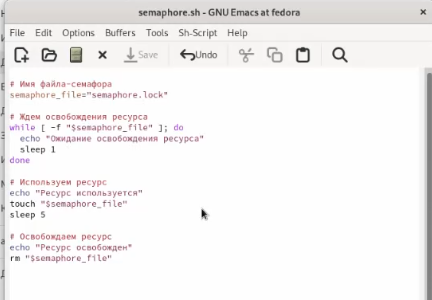
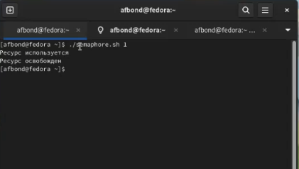
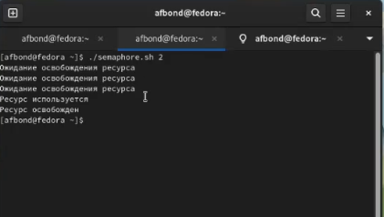
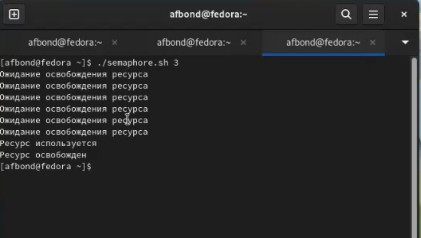
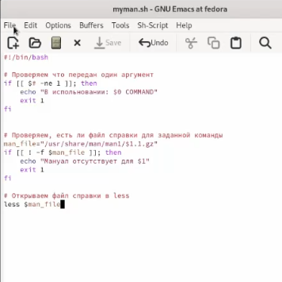
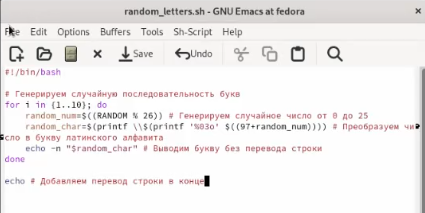
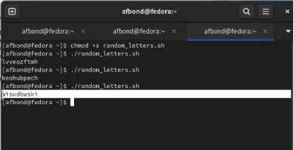

---
## Front matter
title: "Лабораторная работа №13 по предмету Операционные системы"
subtitle: "Группа НПМбв-01-19"
author: "Бондаренко Артем Федорович"

## Generic otions
lang: ru-RU
toc-title: "Содержание"

## Bibliography
bibliography: bib/cite.bib
csl: pandoc/csl/gost-r-7-0-5-2008-numeric.csl

## Pdf output format
toc: true # Table of contents
toc-depth: 2
lof: true # List of figures
lot: true # List of tables
fontsize: 12pt
linestretch: 1.5
papersize: a4
documentclass: scrreprt
## I18n polyglossia
polyglossia-lang:
  name: russian
polyglossia-otherlangs:
  name: english
## I18n babel
babel-lang: russian
babel-otherlangs: english
## Fonts
mainfont: PT Serif
romanfont: PT Serif
sansfont: PT Sans
monofont: PT Mono
mainfontoptions: Ligatures=TeX
romanfontoptions: Ligatures=TeX
sansfontoptions: Ligatures=TeX,Scale=MatchLowercase
monofontoptions: Scale=MatchLowercase,Scale=0.9
## Biblatex
biblatex: true
biblio-style: "gost-numeric"
biblatexoptions:
  - parentracker=true
  - backend=biber
  - hyperref=auto
  - language=auto
  - autolang=other*
  - citestyle=gost-numeric
## Pandoc-crossref LaTeX customization
figureTitle: "Рис."
tableTitle: "Таблица"
listingTitle: "Листинг"
lofTitle: "Список иллюстраций"
lotTitle: "Список таблиц"
lolTitle: "Листинги"
## Misc options
indent: true
header-includes:
  - \usepackage{indentfirst}
  - \usepackage{float} # keep figures where there are in the text
  - \floatplacement{figure}{H} # keep figures where there are in the text
---
# Цель работы

Изучить основы программирования в оболочке ОС UNIX. Научиться писать более сложные командные файлы с использованием логических управляющих конструкций и циклов.


# Задание

1. Написать командный файл, реализующий упрощённый механизм семафоров. Командный файл должен в течение некоторого времени t1 дожидаться освобождения ресурса, выдавая об этом сообщение, а дождавшись его освобождения, использовать его в течение некоторого времени t2<>t1, также выдавая информацию о том, что ресурс используется соответствующим командным файлом (процессом). Запустить командный файл в одном виртуальном терминале в фоновом режиме, перенаправив его вывод в другой (> /dev/tty#, где # — номер терминала куда перенаправляется вывод), в котором также запущен этот файл, но не фоновом, а в привилегированном режиме. Доработать программу так, чтобы имелась возможность взаимодействия трёх и более процессов.

2. Реализовать команду man с помощью командного файла. Изучите содержимое каталога /usr/share/man/man1. В нем находятся архивы текстовых файлов, содержащих справку по большинству установленных в системе программ и команд. Каждый архив можно открыть командой less сразу же просмотрев содержимое справки. Командный файл должен получать в виде аргумента командной строки название команды и в виде результата выдавать справку об этой команде или сообщение об отсутствии справки, если соответствующего файла нет в каталоге man1.

3. Используя встроенную переменную $RANDOM, напишите командный файл, генерирующий случайную последовательность букв латинского алфавита. Учтите, что $RANDOM выдаёт псевдослучайные числа в диапазоне от 0 до 32767.

# Выполнение лабораторной работы

Написал командный файл, реализующий упрощённый механизм семафоров. (Ссылка: Рис.1)



Рис. 1: Командный файл, реализующий упрощённый механизм семафоров

Этот командный файл в течение некоторого времени дожидается освобождения ресурса, выдавая об этом сообщение, а дождавшись его освобождения, использует его в течение некоторого времени также выдавая информацию о том, что ресурс используется. Запустил несколько процессов в нескольких терминалах для демонстрации. (Ссылка: Рис.2)(Ссылка: Рис.3)(Ссылка: Рис.4)



Рис. 2: Происходящее после запуска командного файла в первом терминале



Рис. 3: Происходящее после запуска командного файла во втором терминале



Рис. 4: Происходящее после запуска командного файла в третьем терминале

  Реализовал команду man с помощью командного файла. Изучил содержимое каталога /usr/share/man/man1. В нем находятся архивы текстовых файлов, содержащих справку по большинству установленных в системе программ и команд. Каждый архив можно открыть командой less сразу же просмотрев содержимое справки. (Ссылка: Рис.5)
  




Рис. 5: Код реализации команды man с помощью командного файла

Командный файл получает в виде аргумента командной строки название команды и в виде результата выдает справку об этой команде, если соответствующего файла нет в каталоге man1, то командный файл выдает сообщение об отсутствии мануала. (Ссылка: Рис.6)


Рис. 6: Результат использования командного файла в терминале

Используя встроенную переменную $RANDOM, написал командный файл, генерирующий случайную последовательность из 10 букв латинского алфавита. (Ссылка: Рис.7)



Рис. 7: Код реалицазии командного файла с $RANDOM

После запуска командного файла, он генерирует различные комбинации латинских букв.(Ссылка: Рис.8)



Рис. 8: Демонстрация случайно сгенерированных последовательностей в терминале после запуска скрипта

```
```

# Выводы

Таким образом, мы изучили основы программирования в оболочке ОС UNIX. Научились писать более сложные командные файлы с использованием логических управляющих конструкций и циклов. Приобрели навык по использованию упрощённого механизма семафоров, научились реализовать команду man с помощью командного файла, использовать переменную $RANDOM

# Ответы на контрольные вопросы
1. Найдите синтаксическую ошибку в следующей строке:
```
 while [$1 != "exit"]
```
Синтаксическая ошибка в строке заключается в том, что не хватает пробелов вокруг оператора сравнения. Правильная запись выглядела бы так:
```
while [ $1 != "exit" ]
```
2. Как объединить (конкатенация) несколько строк в одну?

В Bash для объединения (конкатенации) нескольких строк в одну можно использовать оператор конкатенации + внутри кавычек, например:

```
string1="Hello"

string2="World"

result="$string1 $string2"

echo "$result"
```
В результате выполнения скрипта на экран будет выведено: "Hello World".

3. Найдите информацию об утилите seq. Какими иными способами можно реализовать её функционал при программировании на bash?

Утилита seq используется для генерации последовательностей чисел. Её синтаксис выглядит следующим образом:

```
seq [OPTION]... LAST
seq [OPTION]... FIRST LAST
seq [OPTION]... FIRST INCREMENT LAST
```
Например, чтобы сгенерировать последовательность чисел от 1 до 10, можно использовать команду seq 1 10.

Для генерации последовательностей чисел в bash можно также использовать цикл for:


```
for i in {START..END}; do
  echo $i
done
```


4. Какой результат даст вычисление выражения $((10/3))?

Результат вычисления выражения $((10/3)) будет равен 3. В Bash целочисленное деление производится оператором "/", который возвращает только целую часть от деления, без округления.

5. Укажите кратко основные отличия командной оболочки zsh от bash.

Командная оболочка zsh (Z Shell) имеет некоторые отличия от bash, включая:

Автодополнение (completion) в zsh работает более интеллектуально, подсказывая аргументы команд, опции и параметры на основе контекста ввода.

Встроенная поддержка для расширенной истории команд, которая позволяет повторять и редактировать команды из истории более эффективно, чем в bash.

Мощная система управления заданиями, которая позволяет управлять заданиями более гибко, чем в bash.

Встроенная поддержка сжатия (компрессии) и декомпрессии файлов.

Синтаксис именования переменных и замены подстановок в zsh более гибкий и мощный, чем в bash.

Zsh поддерживает концепцию «фреймов», которые могут быть использованы для создания виртуальных окружений и управления локальными настройками командной оболочки.

Zsh имеет множество встроенных функций, которые упрощают работу с файлами и строками.

Bash является более широко используемой командной оболочкой и, следовательно, имеет более обширную документацию и большее количество пользовательских скриптов и плагинов.

6. Проверьте, верен ли синтаксис данной конструкции
```
for ((a=1; a <= LIMIT; a++))
```
Данный синтаксис является верным для командной оболочки bash и используется для создания цикла for с числовой последовательностью. Однако, значение переменной LIMIT должно быть определено заранее в коде скрипта.

7. Сравните язык bash с какими-либо языками программирования. Какие преимущества у bash по сравнению с ними? Какие недостатки?

Преимущества Bash по сравнению с C:

Bash код проще читать и писать, поскольку Bash имеет более простой и лаконичный синтаксис, чем C.
Bash имеет встроенную поддержку для работы с файловой системой и многими Unix-утилитами, что делает написание скриптов более простым и удобным, чем в C.
Bash скрипты могут быть более переносимыми между различными платформами, чем приложения на C.
Недостатки Bash по сравнению с C:

Bash код может быть медленнее в выполнении, чем C.
Bash не подходит для написания крупномасштабных приложений, как это может быть сделано на C.
Bash не имеет полноценных механизмов для работы с памятью и указателями, как в C.
