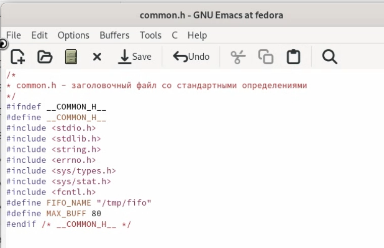
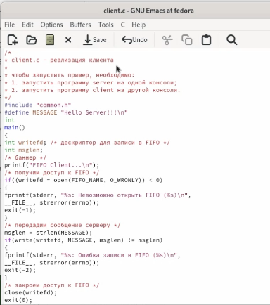
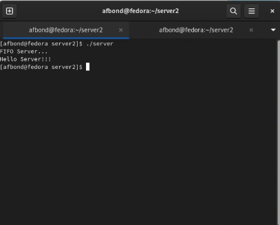
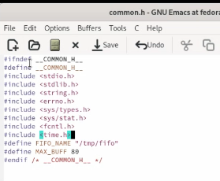
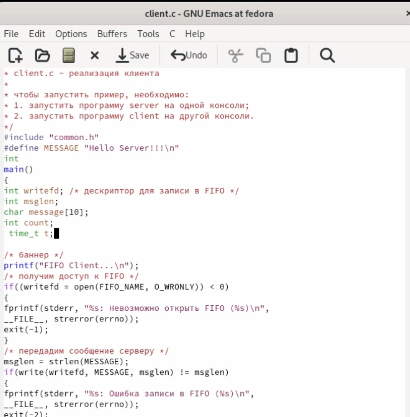
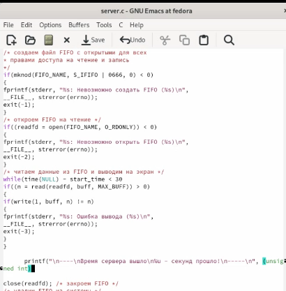
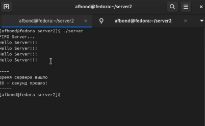
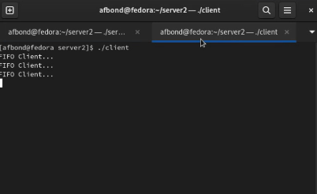

---
## Front matter
title: "Лабораторная работа №15 по предмету Операционные системы"
subtitle: "Группа НПМбв-01-19"
author: "Бондаренко Артем Федорович"

## Generic otions
lang: ru-RU
toc-title: "Содержание"

## Bibliography
bibliography: bib/cite.bib
csl: pandoc/csl/gost-r-7-0-5-2008-numeric.csl

## Pdf output format
toc: true # Table of contents
toc-depth: 2
lof: true # List of figures
lot: true # List of tables
fontsize: 12pt
linestretch: 1.5
papersize: a4
documentclass: scrreprt
## I18n polyglossia
polyglossia-lang:
  name: russian
polyglossia-otherlangs:
  name: english
## I18n babel
babel-lang: russian
babel-otherlangs: english
## Fonts
mainfont: PT Serif
romanfont: PT Serif
sansfont: PT Sans
monofont: PT Mono
mainfontoptions: Ligatures=TeX
romanfontoptions: Ligatures=TeX
sansfontoptions: Ligatures=TeX,Scale=MatchLowercase
monofontoptions: Scale=MatchLowercase,Scale=0.9
## Biblatex
biblatex: true
biblio-style: "gost-numeric"
biblatexoptions:
  - parentracker=true
  - backend=biber
  - hyperref=auto
  - language=auto
  - autolang=other*
  - citestyle=gost-numeric
## Pandoc-crossref LaTeX customization
figureTitle: "Рис."
tableTitle: "Таблица"
listingTitle: "Листинг"
lofTitle: "Список иллюстраций"
lotTitle: "Список таблиц"
lolTitle: "Листинги"
## Misc options
indent: true
header-includes:
  - \usepackage{indentfirst}
  - \usepackage{float} # keep figures where there are in the text
  - \floatplacement{figure}{H} # keep figures where there are in the text
---
# Цель работы

Приобретение практических навыков работы с именованными каналами.


# Задание

Изучите приведённые в тексте программы server.c и client.c. Взяв данные примеры за образец, напишите аналогичные программы, внеся следующие изменения:

1. Работает не 1 клиент, а несколько (например, два).

2. Клиенты передают текущее время с некоторой периодичностью (например, раз в пять секунд). Используйте функцию sleep() для приостановки работы клиента.

3. Сервер работает не бесконечно, а прекращает работу через некоторое время (например, 30 сек). Используйте функцию clock() для определения времени работы сервера. Что будет в случае, если сервер завершит работу, не закрыв канал?

# Выполнение лабораторной работы

Изучил приведённые в тексте программы server.c, client.c. и сommon.h после чего создал специальную дикректорию под тестирование этих файлов и назвал её server (Ссылка: Рис.1)


Создал аналогичные программам в лабораторной работе файлы посредстством терминала с помощью команды touch (Ссылка: Рис.2)


После чего в каждый из этих файлов скопировал програмный код из лабораторной работы, внося небольшие корректировки. (Ссылка: Рис.3)(Ссылка: Рис.4)(Ссылка: Рис.5)






После чего скомпилировал эти файлы в два исполняемых server и client. Проверил их на работоспособность, открыв каждый в отдельном терминале. (Ссылка: Рис.6)(Ссылка: Рис.7)




Далее в каждый из файлов внес соответсвующие изменения (Ссылка: Рис.8)(Ссылка: Рис.9)(Ссылка: Рис.10)







По итогу этих изменений получилось следующее:

Работает не 1 клиент, а несколько.

Также теперь каждый последующий клиент присоединяется с определенным интервалом.

Теперь сервер работает не бесконечно, а прекращает работу через 30 секунд и выводит соответсвующее сообщение. (Ссылка: Рис.11)(Ссылка: Рис.12)





Если сервер завершит работу, не закрыв канал FIFO, то клиент может зависнуть в ожидании ответа от сервера. Это происходит потому, что канал FIFO остается открытым для чтения в клиенте, и процесс не может получить конец файла (EOF), что означает, что он продолжает ожидать ответа от сервера. Кроме того, если сервер не закроет канал FIFO перед завершением, канал будет оставаться в системе, занимая ресурсы, и его необходимо будет удалить вручную.


```

# Выводы

Таким образом, в ходе работы с именованными каналами были приобретены практические навыки создания и использования именованных каналов для организации межпроцессного взаимодействия.

# Ответы на контрольные вопросы

1. В чем ключевое отличие именованных каналов от неименованных?

Именованные и неименованные каналы в UNIX/Linux используются для обмена данными между процессами.

Ключевое отличие между ними заключается в том, что именованные каналы имеют имена в файловой системе, и к ним можно обратиться из других процессов, как к обычному файлу. В то время как неименованные каналы не имеют имен в файловой системе, и могут использоваться только между процессами, которые были созданы из одного родительского процесса.

Кроме того, именованные каналы могут использоваться для обмена данными между процессами, которые не связаны друг с другом и не являются дочерними процессами родительского процесса. В то время как неименованные каналы могут использоваться только для обмена данными между процессами, которые были созданы из одного родительского процесса.

2. Возможно ли создание неименованного канала из командной строки?

Да, создание неименованного канала (трубы) из командной строки возможно при помощи оператора | (вертикальная черта), который позволяет направлять вывод одной команды на вход другой команды. Например, команда ls -l | grep "file.txt" создаст неименованный канал между командами ls и grep, где вывод команды ls будет передан на вход команды grep, которая отфильтрует строки, содержащие "file.txt". Однако при использовании таких каналов нет возможности управлять процессами, передающими данные через этот канал, в отличие от именованных каналов, которые могут быть созданы в явном виде и управляемы через файловую систему.

3. Возможно ли создание именованного канала из командной строки?

Да, создание именованного канала (также известного как FIFO) возможно из командной строки с помощью утилиты mkfifo. Синтаксис команды выглядит следующим образом:

```
mkfifo имя_канала
```

Здесь имя_канала - это имя, которое будет присвоено каналу. После создания именованного канала, его можно использовать для передачи данных между процессами.

4. Опишите функцию языка С, создающую неименованный канал.

Функция языка C, используемая для создания неименованного канала - это pipe(). Она определена в заголовочном файле <unistd.h> и имеет следующее объявление:

```
int pipe(int pipefd[2]);
```

Аргумент pipefd - это массив целых чисел длиной 2, который будет использоваться для возврата файловых дескрипторов, связанных с каналом. Первый элемент массива (т.е. pipefd[0]) будет использоваться для чтения из канала, а второй элемент (т.е. pipefd[1]) - для записи в канал.

5. Опишите функцию языка С, создающую именованный канал.

Функция языка C для создания именованного канала называется mkfifo() и объявлена в заголовочном файле <sys/stat.h>.

Синтаксис функции:

```
int mkfifo(const char *pathname, mode_t mode);
```

Параметры функции:

pathname - указатель на строку, содержащую имя именованного канала.

mode - режим доступа, который будет присвоен именованному каналу.

Функция возвращает 0 в случае успеха и -1 в случае ошибки.

6. Что будет в случае прочтения из fifo меньшего числа байтов, чем находится в канале? Большего числа байтов?

При чтении из FIFO будет считано только то количество байтов, которое доступно в данный момент. Если запрошенное количество байтов меньше, чем находится в канале, то функция чтения блокируется до тех пор, пока не будет доступно запрошенное количество байтов.

Если запрошенное количество байтов больше, чем находится в канале, то функция чтения блокируется до тех пор, пока не будет доступно запрошенное количество байтов. Если другой процесс записывает данные в FIFO, то функция чтения будет блокироваться, пока не будет доступно запрошенное количество байтов. Если процесс записи закрывает FIFO, то функция чтения возвращает 0, что сигнализирует о том, что канал закрыт

7. Аналогично, что будет в случае записи в fifo меньшего числа байтов, чем позволяет буфер? Большего числа байтов?

Если в FIFO записывается меньшее количество байт, чем позволяет буфер, то они будут записаны в FIFO, а оставшееся место в буфере останется свободным.

Если в FIFO записывается большее количество байт, чем позволяет буфер, то запись будет произведена только до тех пор, пока весь буфер не будет заполнен. После этого процесс, который пишет в FIFO, будет заблокирован до тех пор, пока другой процесс не прочитает данные из FIFO и не освободит место в буфере.

8. Могут ли два и более процессов читать или записывать в канал?

Да, два и более процессов могут читать или записывать в канал, если они имеют соответствующие права доступа к каналу и следуют правильному протоколу чтения/записи в канал.

При чтении из канала каждый процесс получает свою копию данных, записанных в канал. Таким образом, если два или более процесса читают из канала, они могут получить одни и те же данные в разных экземплярах.

При записи в канал каждый процесс может записывать данные в канал независимо от других процессов. Тем не менее, при записи в канал следует учитывать размер буфера канала, чтобы избежать блокировки процессов, ожидающих чтения данных из канала.

9. Опишите функцию write (тип возвращаемого значения, аргументы и логику работы). Что означает 1 (единица) в вызове этой функции в программе server.c (строка 42)?

Функция write используется для записи данных в файловый дескриптор. Она возвращает количество записанных байтов или -1 в случае ошибки.

Синтаксис функции:

```
ssize_t write(int fd, const void *buf, size_t count);
```
где:

fd - файловый дескриптор, куда будут записываться данные;

buf - указатель на буфер с данными, которые нужно записать;

count - количество байтов для записи.

В программе server.c значение 1 (единица) в вызове функции write указывает на файловый дескриптор стандартного вывода (STDOUT_FILENO), куда будут выводиться данные из канала. В данном случае, функция write используется для вывода прочитанных данных из FIFO на экран.

10. Опишите функцию strerror.

strerror() - это функция языка программирования С, которая преобразует код ошибки в строку сообщения об ошибке. Она возвращает указатель на строку, содержащую сообщение об ошибке, соответствующее переданному коду ошибки.
